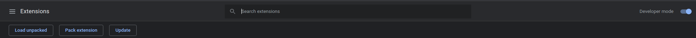
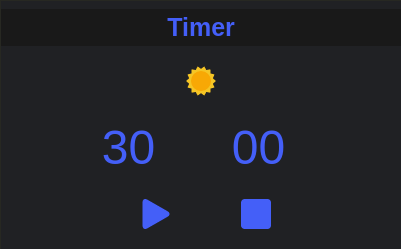
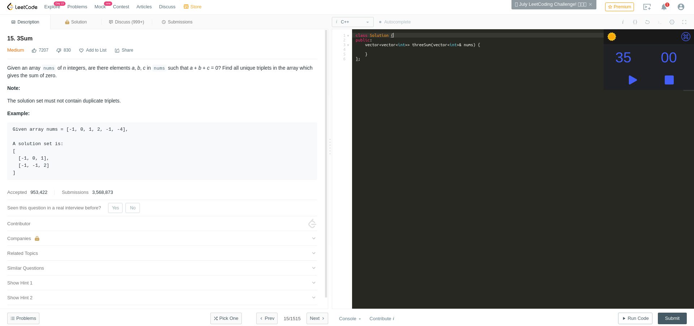

## Timer extension for leetcode

#### To run the chrome extension locally go to `chrome://extensions`

#### Turn Developer mode ON, click `load unpacked` button and select the downloaded extension folder.

The timer runs on all urls but it appears by itself on leetcode.com/problems/... pages only.

However you can you use the timer on any website by pressing <kbd>ctrl</kbd><kbd>shift</kbd><kbd>h</kbd>

The default time is 30 minutes, which can be configured by hovering the cursor over time while timer is not running.

You can drag the timer by clicking the Timer header.

### Key bindings :

#### play/pause <kbd>ctrl</kbd><kbd>shift</kbd><kbd>space</kbd>

#### hide/show <kbd>ctrl</kbd><kbd>shift</kbd><kbd>h</kbd>

#### reset <kbd>ctrl</kbd><kbd>shift</kbd><kbd>q</kbd>

Your preferred timer position, time and theme will be stored in local storage.

